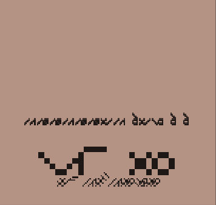
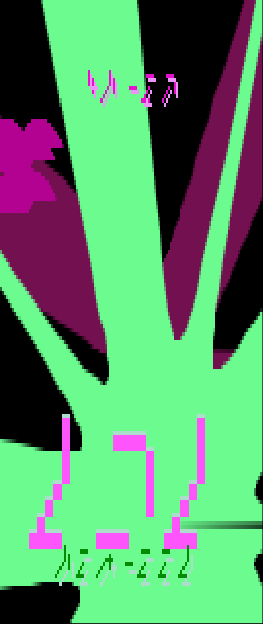
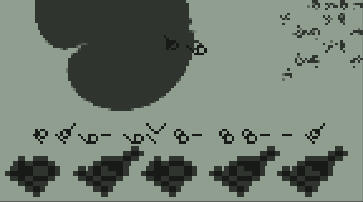

# METAME

**METAME** is the first **M**ultiple **E**xtra**T**errestrial **A**rcade **M**achine **E**mulator. You can play it [here](https://www.kesiev.com/metame).

## Story

NASA is reporting that countless of unlicensed (I hope) alien early videogame ROMs are being streamed in space as we speak.

Since the amount of available games is hard to manage, METAME will download a random game and play it. To save a game just add it to your browser bookmarks - however game indexes may change during development.

This emulator is far from being complete and alien gaming experiences are mostly obscure and scary. It may result in a both inspiring and disturbing experience to you. Play it at your own risk.

## How to play

METAME uses arrow keys as general motion input and Z button as alternate action. Tested on Firefox and Chrome desktop.

## What?!

METAME implements a number of traits taken from a lot of classic videogames - ranging from entity interaction rules to the lettering, art style and even sounds. It shuffles them together, makes sure that there are enough winning and losing conditions - even a game ending - and then let you play the final result, whatever it is in a playable state or not.

    

It creates an unlimited number of weird picturesque interactive experiences, ranging from the enlightening and inspiring to disorientating and disturbing ones.

    

All of METAME games shares a common feeling - the puzzling sense of exploring something both familiar and unknown that needs **interpretation, creativity and curiosity**.

    

These are the most important values I've met in my life till now. I decided to celebrate and share them with you with METAME.
